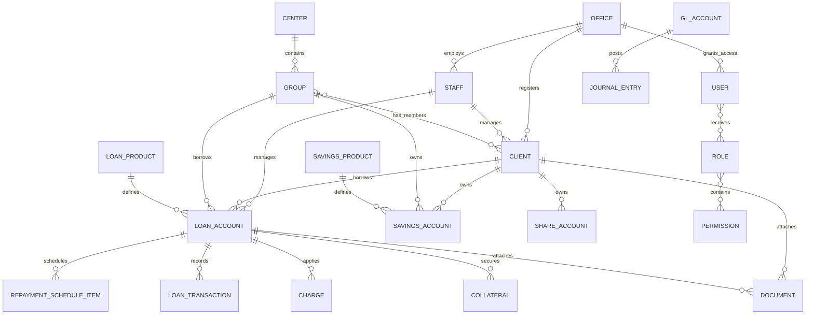
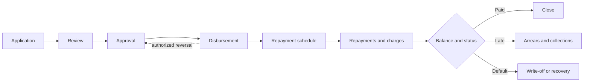

# Jumpstart Lending System Audit and Replacement Blueprint

Audit date: 1 September 2026  
Legacy tenant: `jumpstart` on `ilendloans.net`  
Audit mode: authenticated, read-only browser inspection

## Safety and Scope

- No records, fields, users, transactions, configurations, or files were created, edited, approved, posted, reversed, or deleted.
- Create and edit screens were opened only to inspect their schemas. No forms were submitted.
- Financial actions such as repayment, disbursement, foreclosure, charge posting, journal posting, and account closure were not invoked.
- This document records fields and modules that exist in the legacy system. A replacement must not add business fields until the owner approves a separate schema change.
- Credentials are intentionally not recorded in this repository. Because they were shared in chat, rotate the password after discovery and data recovery are complete.

## Executive Summary

The legacy application is a customized Apache Fineract/Mifos X-style microfinance system. It is an AngularJS single-page application backed by Fineract REST endpoints under `/fineract-provider/api/v1/`.

The visible navigation understates its size. The loaded route registry contains **346 distinct routes**, covering client, group, center, loan, savings, share, deposit, accounting, reporting, cash-management, administration, audit, and configuration workflows.

Data is still accessible through authenticated read-only API requests. Verified examples:

- `GET /fineract-provider/api/v1/clients?limit=15&offset=0`
- `GET /fineract-provider/api/v1/loanproducts`
- `GET /fineract-provider/api/v1/savingsproducts`
- `GET /fineract-provider/api/v1/runreports/FullReportList?genericResultSet=false&parameterType=true`

The safest recovery strategy is to export through those GET APIs or obtain a database backup from the host. Screen scraping should be the last resort.

## Organization and Access Model

Observed organization structure:

- Head Office
- Entebbe Branch

Observed staff assignment behavior:

- Clients can be assigned or unassigned to staff.
- Loans have a business development/loan officer.
- Groups and centers can have staff assignments.
- Users are separate from employees: employees may represent loan officers without system access.
- Roles and permissions are configurable.
- Maker-checker tasks are configurable.
- Audit trails record activities such as creating clients and disbursing loans.
- Two-factor authentication and password policies are configurable.

## Primary Navigation

| Area | Screens and capabilities |
|---|---|
| Home | Dashboard, office selector, client trends by week/month/day, new clients, loans disbursed, amount collected today, amount disbursed today |
| Clients | Client list, show closed, create, bulk import, client detail, family, identity, documents, notes |
| Accounts | Active loans, savings accounts, loans in arrears, overpaid loans, written-off loans, closed loans |
| Groups | Group list and center list |
| Accounting | Frequent postings, journal entries, journal search, financial activity mappings, opening balances, chart of accounts, closing entries, accounting rules, accruals, provisioning |
| Reports | All, clients, loans, savings, new/fund reports, accounting, XBRL, new reports |
| MMT | Mobile-money posted and pending payments |
| CRB/C-Score | Credit score, delinquency, identity check |
| Admin | Users, organization, system, products, templates |
| Quick actions | Client, group, center, collection sheet, individual collection sheet, tasks, notifications |

## Core Entity Map

## Data Types and Field Inventory

### Client

Observed creation fields:

| Field | Type | Required/behavior |
|---|---|---|
| Office | office reference/autocomplete | Required |
| Legal form | coded selection | Optional; displayed as a select |
| First name | text | Required |
| Middle name | text | Optional |
| Last name | text | Required |
| Is staff | boolean | Checkbox |
| Mobile number | text | Optional; keep as text, not numeric |
| Date of birth | date | Optional |
| Gender | coded selection | Optional |
| Client type | coded selection | Optional |
| Client classification | coded selection | Optional |
| External ID | text | Optional |
| Active | boolean | Controls activation on creation |
| Submitted on | date | Optional |

Observed list fields: name, client number, external ID, status, office, staff.  
Observed detail fields: activation date, group membership, staff status, mobile number, gender, date of birth, loan-cycle count, last-loan amount, active-loan count, active-savings count, image, signature.

Related client records:

- Family members
- Identity documents: ID, description, type, attached identity documents, status
- General documents: name, description, file name
- Notes
- Charges
- Loans, including active and closed accounts
- Savings, including active and closed accounts
- Share accounts
- Group membership

Client actions observed: edit, new loan, new saving, add charge, transfer, close, assign/unassign staff, image capture/upload, signature view.

### Group

| Field | Type | Required/behavior |
|---|---|---|
| Office | office reference/autocomplete | Required |
| External ID | text | Optional |
| Name | text | Required |
| Submitted on | date | Present |
| Staff | staff reference/autocomplete | Optional |
| Active | boolean | Checkbox |
| Client members | client reference list | Add one or more clients |

### Center

| Field | Type | Required/behavior |
|---|---|---|
| Name | text | Required |
| Office | office reference/autocomplete | Required |
| Staff | staff reference/autocomplete | Optional |
| Active | boolean | Checkbox |
| External ID | text | Optional |
| Submitted on | date | Present |
| Groups | group reference list | Select and add groups |

### User

| Field | Type | Required/behavior |
|---|---|---|
| Username | text | Required |
| First name | text | Required |
| Last name | text | Required |
| Email | email | Required |
| Auto-generate password | boolean | Checkbox |
| Office | office reference/autocomplete | Required |
| Staff | staff reference/autocomplete | Optional |
| Roles | many-to-many role selection | Available and assigned lists |

### Loan Product

Configured product names observed:

- 4, 8, 12, 16, 20, 24, 30, and 40-week loans
- Business Loan Monthly
- Business Weekly Loan
- Emergency Loan
- Group Loan Product
- Individual Loan Weekly
- Micro-Enterprise Loan Monthly
- Micro-Enterprise Loan Weekly
- Personal Loan and additional products are selectable in loan applications

Product/application concepts observed:

- Product name and short name
- Currency
- Principal/proposed, approved, and disbursed amounts
- Number and frequency of repayments
- Amortization method
- Interest rate and rate period
- Interest type, including flat interest
- Interest calculation period
- Repayment allocation strategy
- Grace periods for principal, interest, and arrears ageing
- Fund source
- Interest-free period
- Partial-period interest-calculation option
- Recalculation option
- Days-in-year and days-in-month rules
- Charges and penalties
- Accounting mappings
- Expiry and active/inactive status

### Loan Account

Observed identifiers and references:

- Internal loan ID
- Display account number
- Client and/or group borrower
- Loan product
- Loan officer
- Office
- External ID
- Fund source
- Currency and currency code

Observed monetary fields must use fixed-precision decimal values, never binary floating point:

- Proposed, approved, disbursed, and original principal
- Principal paid, waived, written off, outstanding, and overdue
- Interest charged, paid, waived, written off, outstanding, and overdue
- Fees and penalties with the same allocation states
- Current balance, total due, total paid, arrears amount
- In-advance, late, waived, and outstanding installment amounts

Observed dates:

- Submitted, approved, expected disbursement, actual disbursement, maturity
- Schedule due date and paid date
- Transaction date
- Charge due/collected/from dates
- Floating-rate effective date

Observed status/lifecycle concepts:

- Submitted/pending approval
- Approved
- Active/disbursed
- Up to date
- In arrears
- Overpaid
- Written off
- Closed
- Rejected/withdrawn/closed variants are implied by registered lifecycle routes and Fineract conventions, but their tenant usage was not confirmed during read-only inspection.

Loan tabs and subordinate records:

- Account detail
- Original, current repayment, and future schedules
- Transactions and transaction breakdown
- Collateral
- Tranche details
- Overdue charges
- Floating interest rates
- Charges
- Documents
- Notes
- Standing instructions

Loan actions observed: add charge, prepay, foreclosure, repayment, undo disbursal, assign officer, schedule adjustment, collateral/document management, and additional actions under the More menu. These actions were not executed.

### Repayment Schedule

Observed columns:

- Installment number and number of days
- Due date and paid date
- Principal due and remaining loan balance
- Interest, fees, and penalties
- Total due and paid
- Amount in advance and late
- Waived and outstanding amounts

### Loan Transaction

Observed columns:

- Transaction ID
- Office
- Transaction date
- Receipt
- Transaction type
- Amount
- Principal/interest/fee/penalty breakdown
- Resulting loan balance

### Savings

Configured products observed:

- Compulsory Savings
- Group General Savings
- LIF Account Savings
- Member Savings Account
- Security Fee Payable
- Security Fee Payable - Individual

Savings product wizard sections:

- Details: product name, short name, description
- Currency
- Terms
- Settings
- Charges
- Accounting: assets, liabilities, expenses, income, advanced accounting rules

Observed savings list fields: account ID, holder name, savings product, balance, available balance, status, and office.

### Shares and Deposits

Registered and visible modules include:

- Share products and share accounts
- Approved and pending shares
- Dividends
- Fixed-deposit products/accounts
- Recurring-deposit products/accounts
- Product mix rules
- Tax components and tax groups
- Floating rates

These are part of the legacy route registry, but active tenant usage was not established.

### Charge

Observed list fields: name, applies-to entity, penalty flag, status. Charges can apply to loan, savings, and deposit products/accounts. Loan-account charge fields include name, fee/penalty classification, payment timing, due date, calculation type, amount due, paid, waived, outstanding, and actions.

### Mobile Money

Two queues are present: posted payments and pending payments.

Observed fields:

- Date created
- MSISDN (text)
- Account name
- Mobile-money sender name
- Provider reference ID
- ILend reference ID
- Reason
- Amount (fixed-precision decimal)
- Post type/status

The UI labels the sender/provider fields as MPESA even though the deployment is in Uganda; provider assumptions must be verified before rebuilding integrations.

### Accounting

Capabilities:

- Chart of accounts
- Manual journal entries
- Frequent/predefined postings
- Advanced journal search
- Closing entries
- Financial-activity-to-GL mappings
- Office-level opening balances
- Accounting rules
- Periodic accruals
- Provisioning entries

Required accounting entities:

- GL account with code, name, type, hierarchy, usage, status
- Journal batch and balanced debit/credit lines
- Office, currency, transaction/reference, posting date, created-by user
- Financial activity mappings
- Opening balances and period closures
- Reversal linkage and immutable audit metadata

### Reports

Report catalogue fields: name, rendering type, category. Rendering types observed include Table and Pentaho.

Observed configured reports include:

- Active Loans
- Active with Null Loan Officer
- All Loans by Disbursal Period
- Arrears Report
- Balance Sheet
- Branch Portfolio
- Client Listing
- Disbursal Report
- Expected Daily Collection per Officer
- General Ledger Report
- Income Statement
- Journal Entries Reconciliation
- Jumpstart Aging Report
- Jumpstart Collection Report
- Non-Performing Loans

The catalogue has at least two pages. Each report can have runtime parameters; XBRL exposes portfolio, balance sheet, income, expense, and date-period views.

### Templates

Observed fields:

- Entity: client or loan
- Type: document or SMS
- Template name
- Rich-text/template body
- Advanced options

### Configuration and Audit

Organization configuration:

- Offices and hierarchy
- Holidays
- Employees
- Standing-instruction history
- Fund mapping and funds
- Password preferences
- Loan provisioning criteria
- Entity data-table checks
- Currency configuration
- Bulk loan reassignment
- Teller/cashier management and settlement
- Working days
- Payment types
- SMS campaigns
- Ad hoc queries
- Bulk imports and spreadsheet templates

System configuration:

- Data tables (custom entity fields)
- Codes and dropdown values
- Roles and permissions
- Maker-checker tasks
- Hooks
- Entity-to-entity mappings
- Surveys
- Audit trails
- Report definitions
- Scheduler jobs
- Global and cache configuration
- Account-number preferences
- External services
- Two-factor authentication

Product configuration:

- Loan, savings, share, fixed-deposit, and recurring-deposit products
- Charges and penalties
- Product-mix rules
- Tax configuration
- Floating rates

## Key Workflows

### Client Onboarding

1. Select office and optional legal form.
2. Capture identity/profile fields and optional classification.
3. Optionally activate with a submitted-on date.
4. Assign staff and optionally group membership.
5. Add family, identity, document, image, signature, note, and charge records.
6. Create loan, savings, share, or deposit accounts as permitted.

### Loan Lifecycle

Maker-checker must be preserved where configured. Every lifecycle command needs idempotency, permission checks, an append-only audit event, and a linked accounting transaction.

### Collections

- Collection sheet
- Individual collection sheet
- Amount-collected dashboard metric
- Expected daily collection by officer report
- Mobile-money payment queues
- Repayment posting and transaction allocation
- Arrears, aging, and non-performing-loan reports

### Accounting Posting

Loan and savings transactions should generate balanced journal entries through product accounting mappings. Manual and frequent journal postings, opening balances, closing entries, accruals, and provisioning remain separate controlled workflows.

## Observed Data Volume and Configuration

- Client list showed 60 pagination pages at a default 15 records per page. This suggests hundreds of client records, but the exact total was not read from the API metadata and must not be inferred as exactly 900.
- Active-loan data is present with principal, interest, fee, arrears, paid, and outstanding values.
- The loan-product list has multiple pages.
- The report catalogue has multiple pages.
- Two offices were visible.
- Existing records include group loans and individually managed loans.

Do not treat UI pagination as an export method. Use API pagination until the server-reported total is reached.

## Defects and Risks

### Critical

1. **No dependable owner-supported export path.** Business continuity depends on recovering data before hosting, credentials, or APIs disappear.
2. **Credential exposure.** The current credential was sent in chat and should be rotated after recovery.
3. **Legacy AngularJS application.** The frontend uses outdated dependencies and a large custom route surface, increasing security and maintainability risk.
4. **Financial migration risk.** Balances cannot be migrated as loose totals; schedules, allocations, reversals, write-offs, charges, and GL entries must reconcile.

### High

1. Some CRB/Admin hash routes initially left stale content or a blank view instead of showing an error.
2. Several pages rendered empty until delayed API responses arrived. Loading and error states are unreliable.
3. The dashboard showed `No Data` for daily collection/disbursement at inspection time without distinguishing zero activity from fetch failure.
4. The route registry has 346 screens, making an undocumented one-for-one rewrite risky.
5. **The account export failure is reproduced and verified.** “Export To Document” calls the AngularJS controller's `export()` function, which builds CSV data from the rendered HTML table and calls `table.export2file(...)`. The bundled `tableexport` library throws `TypeError: r is not a function` inside `tableexport.js`, so no browser download starts. The underlying active-loans GET request succeeds; this is a frontend library/API incompatibility rather than evidence that the records are unavailable.

### Medium

1. Field labeling is inconsistent; some controls inherit the wrong nearby label in the DOM.
2. Mobile-money terminology is MPESA-specific despite Uganda deployment.
3. Status is often conveyed by color/icon with little text, weakening accessibility and exports.
4. Dashboard numbers lack period comparison and clear freshness/error metadata.
5. Some untranslated keys are visible, such as `label.anchor.newReports`.

## Data Recovery Plan

### 1. Freeze and Preserve

- Do not make schema/configuration changes in the legacy system.
- Record tenant identifier, application version, Fineract version if discoverable, locale, timezone, date format, and currency configuration.
- Request a full database dump and attachment/document storage archive from the host first.
- Preserve the application bundles and configuration files for forensic reference.

### 2. API Export

Build a read-only exporter that authenticates as a dedicated export user and sends GET requests only.

Export in dependency order:

1. Offices, currencies, codes, funds, payment types, holidays, working days
2. Employees, users, roles, permissions
3. GL accounts, accounting rules, financial mappings
4. Product definitions, charges, rates, tax configuration
5. Centers, groups, clients, family, identity and custom data tables
6. Loan, savings, share, fixed-deposit, and recurring-deposit accounts
7. Repayment schedules, transactions, charges, collateral, notes, standing instructions
8. Journal entries, closures, opening balances, accruals, provisioning
9. Documents, images, signatures, and template bodies
10. Audit trails, maker-checker tasks, jobs, hooks, reports, and external-service settings

For every endpoint, save:

- Raw immutable JSON response
- Retrieval timestamp
- Tenant and endpoint
- Query parameters and page/offset
- HTTP status
- SHA-256 checksum
- Record count and server-reported total

Never write secrets into export files or logs.

### 3. Reconciliation

The export is acceptable only when:

- Every paginated endpoint reaches its server-reported total.
- Client/account counts reconcile by office and status.
- Each loan satisfies principal and repayment-allocation checks.
- Savings balances equal transaction-ledger balances.
- Journal batches balance: total debits equal total credits per currency.
- Trial balance, balance sheet, income statement, arrears, aging, and collection reports match the legacy system for agreed cutoff dates.
- Documents and images match exported checksums.
- Foreign-key references have no unexplained orphans.

### 4. Cutover

- Choose and communicate a transaction cutoff time.
- Run a full export, then a delta export after the cutoff.
- Reconcile and obtain written business sign-off.
- Keep the legacy system read-only for an agreed retention period.
- Rotate legacy credentials and archive encrypted backups.

## Replacement-System Boundaries

Build in phases, preserving observed fields and behavior:

1. **Recovery tooling:** read-only exporter, raw archive, checksums, reconciliation reports.
2. **Foundation:** offices, staff, users, roles, permissions, codes, audit log.
3. **Customer management:** clients, groups, centers, identity, documents, notes.
4. **Loan servicing:** products, applications, approval, disbursement, schedules, repayment, arrears, closure, write-off.
5. **Savings and shares:** products, accounts, transactions, charges, standing instructions.
6. **Accounting:** mappings, journal engine, manual entries, closures, trial balance and statements.
7. **Collections and mobile money:** sheets, queues, matching, posting, reversals.
8. **Reports and administration:** operational reports, audit, configuration, jobs, imports.

Do not clone all 346 routes as separate pages. Preserve capabilities and audit behavior while consolidating repeated create/view/edit/action routes into coherent modules.

## Non-Negotiable Technical Rules

- Use integer minor units or an exact decimal type for money, with currency attached.
- Store phone numbers, account numbers, external IDs, MSISDNs, and receipt numbers as strings.
- Store business dates separately from timestamps; timestamps must include timezone/UTC rules.
- Use explicit enums/reference tables for statuses and coded dropdowns.
- Make financial transactions append-only; corrections use linked reversals.
- Keep audit events immutable with actor, timestamp, action, entity, before/after or command payload, and correlation ID.
- Make posting commands idempotent.
- Enforce maker-checker separation where configured.
- Encrypt sensitive PII at rest and in transit; restrict exports by permission.
- Maintain document checksums and immutable object-storage keys.
- Keep product/rate definitions versioned so historical schedules remain reproducible.
- Never derive historical balances from current product settings.

## Open Verification Items

These require further read-only API extraction or business-owner confirmation before implementation:

- Exact record totals for every entity and status
- Full second and later pages of products and reports
- All custom data tables and code values
- Exact loan-product parameters and accounting mappings per product
- Maker-checker tasks currently enabled
- Roles and effective permissions
- Active CRB and mobile-money provider contracts and APIs
- Pentaho report definitions and runtime parameters
- Scheduler job configurations and last-run status
- External-service secrets and endpoints, to be transferred through a secure secret-management process
- Whether the same `tableexport` error affects every other list with an export control
- Regulatory, retention, and approval requirements applicable to the business

## Completion Definition for the System Map

This document provides a complete functional map of the visible application families and the registered route surface, plus verified field-level maps for the core client, group, center, user, loan, savings, accounting, mobile-money, report, and template domains. It does **not** claim that every tenant-specific custom field or every record has been exported. That requires the read-only API recovery phase above.