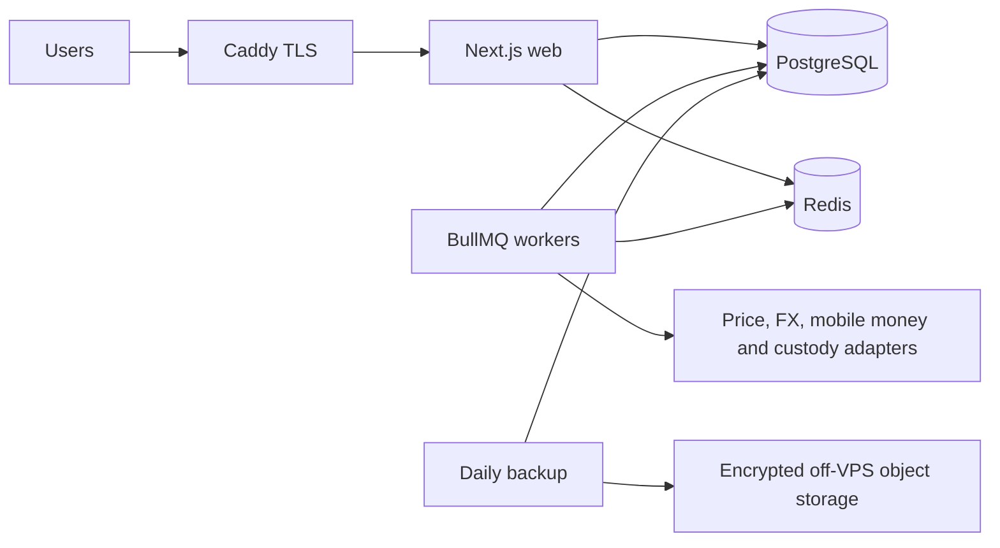

# SovLend Architecture

## Core Decision

SovLend starts as a modular monolith: one Next.js web deployment, one worker deployment, PostgreSQL, and Redis. Domain boundaries are explicit in code and communicate through transactional outbox events. This keeps one-VPS operations simple while preserving clean extraction points when measured scale requires them.

Private keys and seed phrases are outside this architecture. SovLend stores public addresses, unsigned transaction data, transaction hashes, and external signer references only. Production signing belongs in independently controlled hardware wallets, HSMs, or a custody service.

## Runtime

## Modules

| Module | Owns |
|---|---|
| Identity | organizations, offices, users, roles and permissions |
| Clients | clients, groups, centers, KYC and documents |
| Lending | products, applications, loans, schedules and repayments |
| Savings | accounts and savings transactions |
| Treasury | ownership pools, allocations and public wallet metadata |
| Ledger | accounts, journals and immutable journal lines |
| Pricing | provider quotes and immutable accepted snapshots |
| Notifications | reminders, durable inbox notifications and delivery attempts |
| Integrations | Fineract import, mobile money, FX and custody adapters |
| Audit | tamper-evident actor/entity event chain |

## Identity and Access

Better Auth owns credentials, sessions, administrative account controls, and passkeys. Public registration is disabled; an authenticated administrator creates each account and connects it to a SovLend organization, office, and operational role.

- Email/password credentials are hashed by Better Auth and stored only in the PostgreSQL `Account.password` field.
- Passkeys store public credential material and signature counters. Private keys remain on the authenticator.
- Sessions are separately stored, expire after 12 hours, and can be revoked per user.
- Better Auth's `admin`/`user` role controls identity administration. SovLend's `systemRole` controls lending responsibilities such as teller, loan officer, investor, treasury signer, and auditor.
- Admin and security pages perform full server-side session validation. The Next.js proxy is only an early redirect and is never the authorization boundary for financial actions.
- Admin, treasury, and audit roles should require passkeys before production money movement is enabled.

Modules share small primitives such as money and identifiers. Domain code must not directly query another module's tables. Cross-module side effects use application services and outbox events.

## Financial Invariants

1. Money uses integer minor units: UGX 0 decimals, BTC 8, and USDC 6.
2. Every posted journal balances debits and credits independently per currency.
3. Posted journals, transactions, price snapshots, and audit events are immutable.
4. Corrections create linked reversals; they never rewrite financial history.
5. Every external command has an idempotency key.
6. Exchange events record both legs and an immutable price snapshot.
7. Wallet location and economic ownership are separate. Investor capital, client savings liabilities, and company treasury remain distinct even when assets share custody.
8. Loans are initially denominated in UGX. BTC, USDC, cash, bank and mobile money are settlement channels.

## BullMQ and Notifications

BullMQ runs outside HTTP request processes and handles repayment reminders, overdue notices, transactional outbox publication, market and FX price refreshes, mobile-money reconciliation, webhook retries, statements, report generation, and operational health notifications.

The maintenance queue scans installments daily at 05:00 UTC. Reminder job IDs are deterministic: `repayment:<installment-id>:<reminder-type>`. Repeated scans and retries therefore do not create duplicate notices.

Every customer-facing reminder is persisted in PostgreSQL. In-app toasts are transient feedback for the current operator action; they are never the durable record. SMS, email, and push delivery remain provider adapters with independent attempts, statuses, and retry policies.

## Price Policy

- Crypto adapters: CoinGecko, CoinMarketCap, Kraken and Coinbase.
- Forex providers implement the same interface and require at least two independent sources before posting.
- Providers use short timeouts and three exponential-backoff attempts with jitter.
- Stale quotes are rejected. A median is calculated, then outliers beyond the deviation threshold are removed.
- Financial posting fails closed when quorum is unavailable or sources disagree.
- Manual emergency rates require maker-checker approval, a reason, expiry and audit event.
- The UI may show labeled stale estimates; ledger postings may not use them.

## Transaction Pattern

A command validates permissions, office scope, state transition, amount and idempotency. Within one PostgreSQL transaction it updates the aggregate, writes balanced journal lines, stores a price snapshot when relevant, appends an audit event, and appends outbox events. The worker publishes events using their UUID as the queue job ID. Consumers write inbox records to prevent duplicate handling.

## Growth Path

1. **Single VPS:** the topology in `compose.yaml`; PostgreSQL and Redis ports remain private.
2. **Managed data:** move PostgreSQL and object storage off the app host without changing domain code.
3. **Horizontal web:** run stateless web containers behind the edge proxy.
4. **Worker pools:** separate pricing, reminders, reconciliation, reporting and integration queues.
5. **Read scaling:** use PostgreSQL replicas for reports while commands remain on the primary.
6. **Module extraction:** extract pricing, reporting or integrations only when load or team ownership justifies it.
7. **Custody isolation:** deploy signing infrastructure in a different network and security domain before automated value movement.

## Backup and Recovery

The backup container creates a PostgreSQL custom-format dump daily at 01:17 UTC, verifies it with `pg_restore --list`, checksums it, encrypts it through Restic and uploads it to S3-compatible storage outside the VPS. Retention is 7 daily, 5 weekly and 12 monthly snapshots.

Before launch, add PostgreSQL WAL archiving for point-in-time recovery. Restore monthly into an isolated database and reconcile row counts, ledger totals and recent audit events. Initial targets are RPO 24 hours with dumps, RPO 15 minutes after WAL archiving, and RTO 4 hours.

## Security Gates Before Real Funds

- Replace dashboard fixtures with authenticated, office-scoped queries.
- Add phishing-resistant MFA for administrators and treasury signers.
- Implement maker-checker policies and transaction limits.
- Add database constraints that prevent mutation of posted journals.
- Complete threat modeling and an independent security review.
- Integrate approved KYC, AML and sanctions-screening procedures.
- Test chain reorganizations, replaced transactions, provider outages and duplicate callbacks.
- Verify backup restoration and disaster recovery.
- Never store custody private keys in this repository, containers, environment files or PostgreSQL.